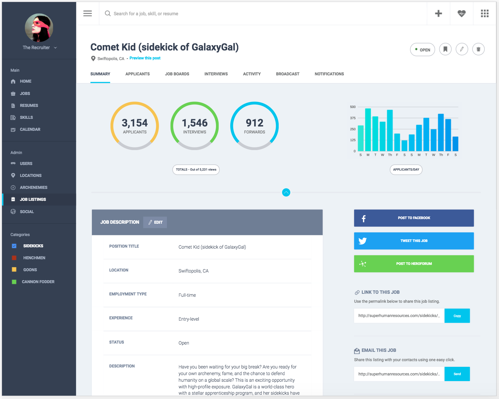
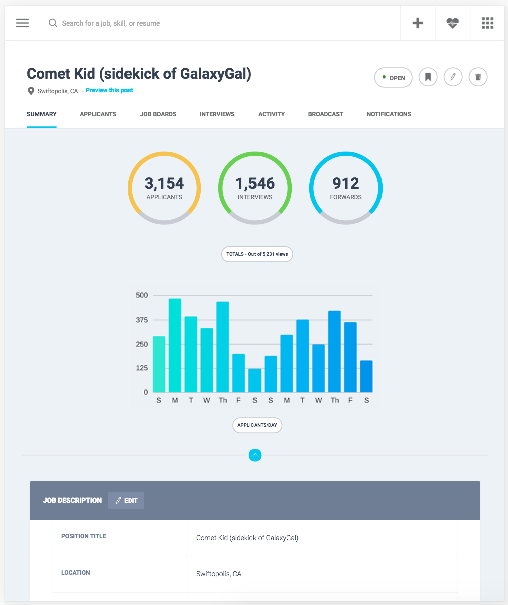
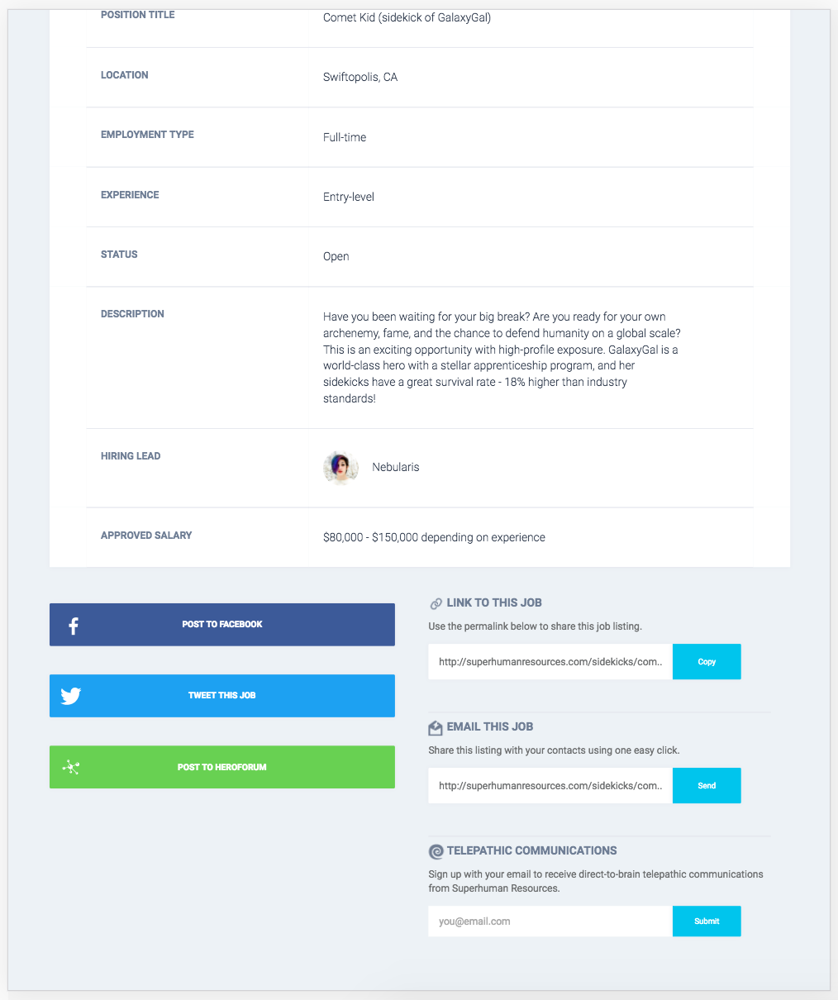
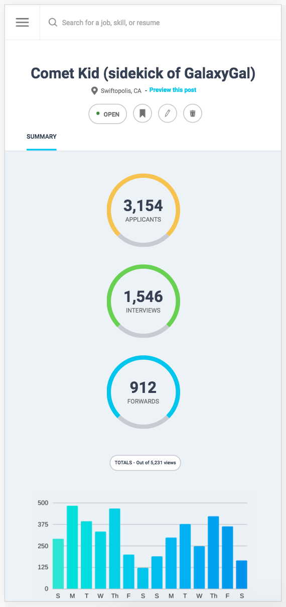
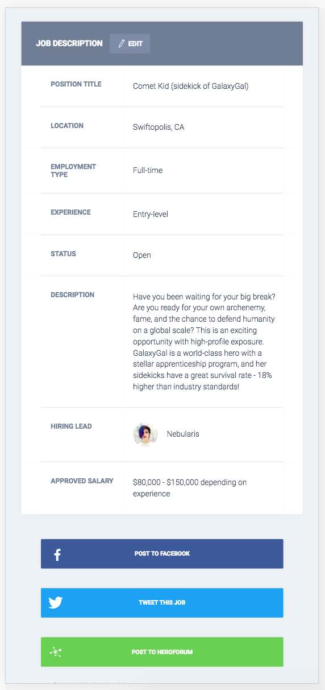
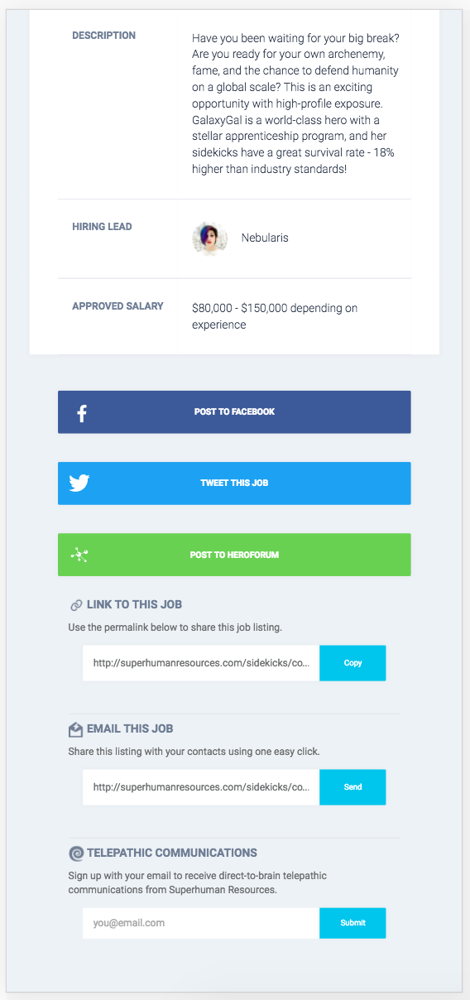
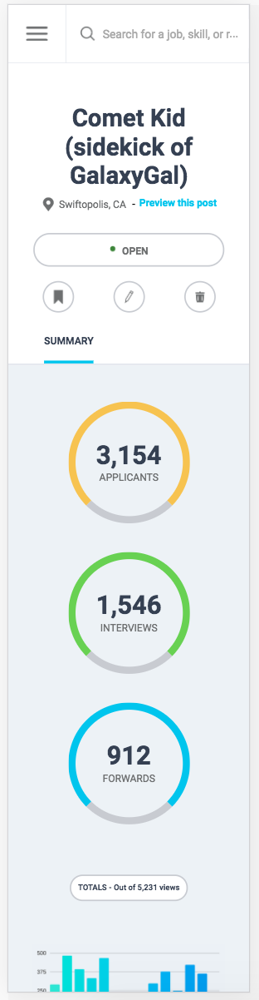
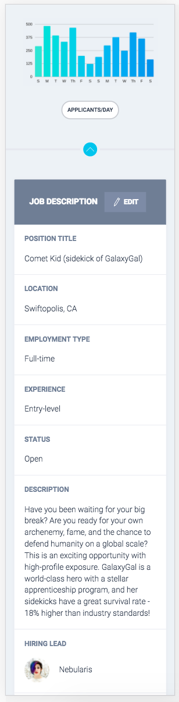
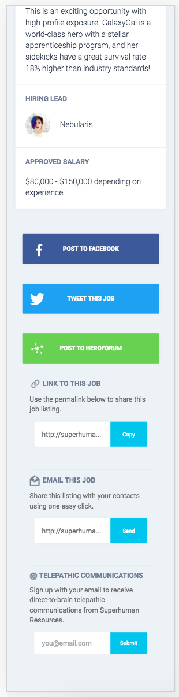

### lk-comp-challenge-3

-----

#### Overview
This is the second of three exercises in turning a static comp into a resopnsive site (html & css only).

The original comp (see below) was for a desktop view. The challenge was concerned with layout and left the colors, assets, and text open to interpretation.

-------

##### Original comp:

Below are a series of my version, which I themed as a site on which users can share and save recipes.

------------

##### Large screen view:

##### Tablet-ish views:

##### Phablet-ish views:

##### Narrow phone views:
  
  

